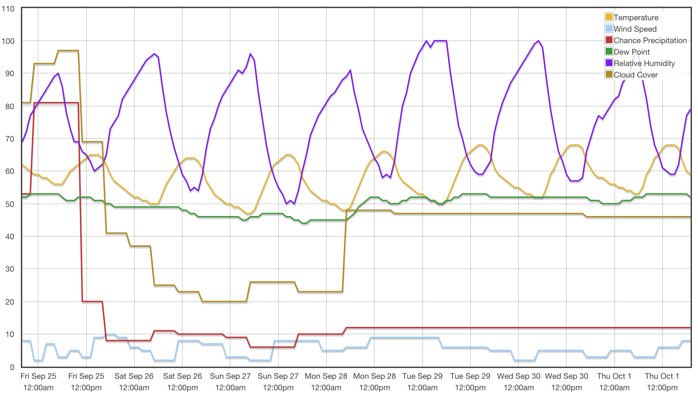

# Seattle Weather

A [condensed chart][1] of weather forecasts at [forecast.gov][0]. Rather than just
48 hours, it shows a full week's prediction.

[0]: http://forecast.weather.gov/MapClick.php?lat=47.60246&lon=-122.31353759765625&FcstType=graphical
[1]: http://weather.brewingcode.net

### Setup

- make sure [node.js](http://nodejs.org) and [roots](http://roots.cx) are
  installed
- clone this repo down and run `cd seattle-weather && npm install`
- install python packages `attrdict beautifulsoup4 requests xmltodict`
- run `roots_ignore/buildjson` to fetch data from web and generate json
- run `roots watch`
